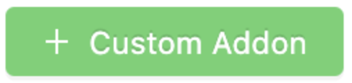
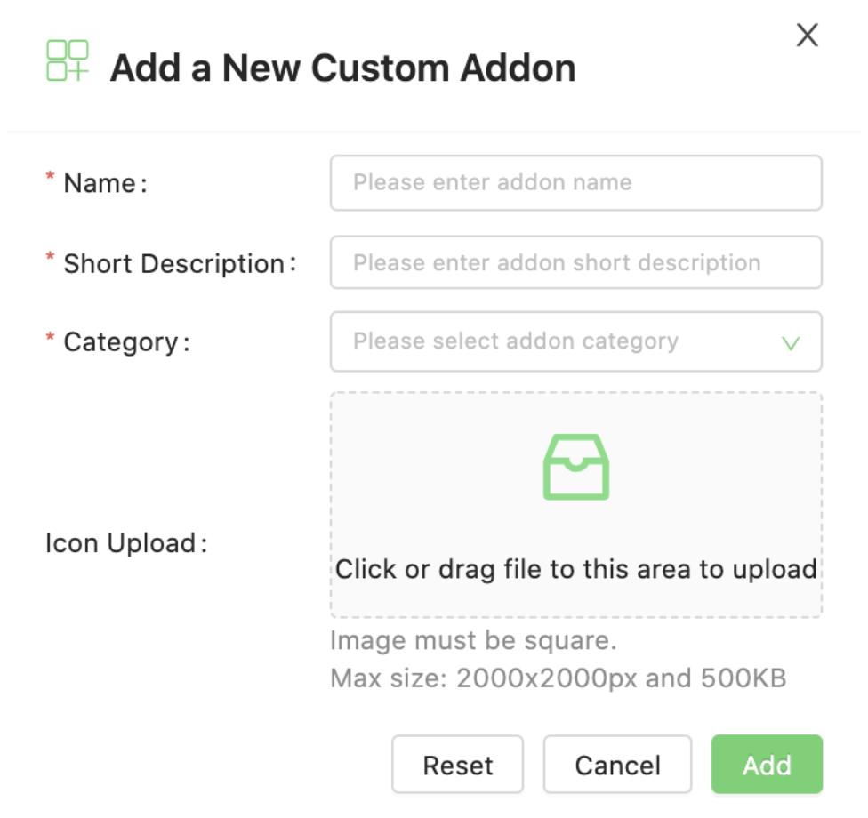
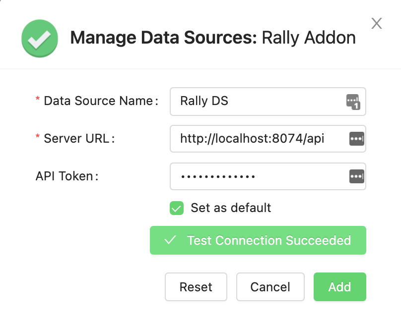
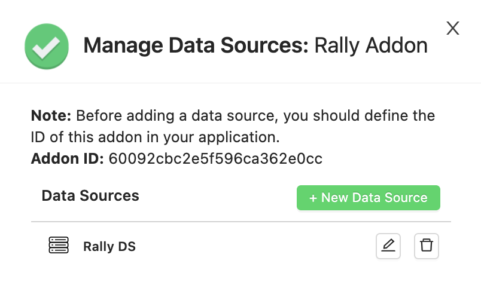
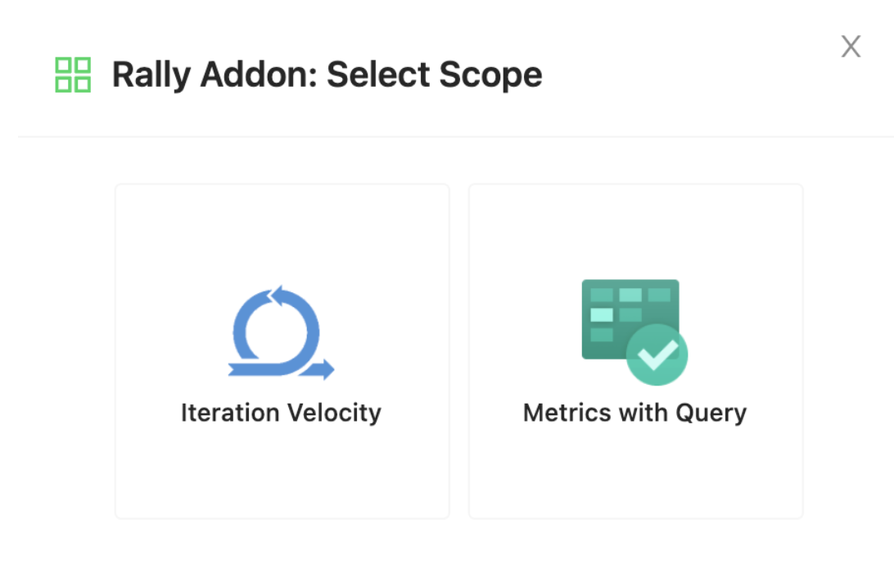
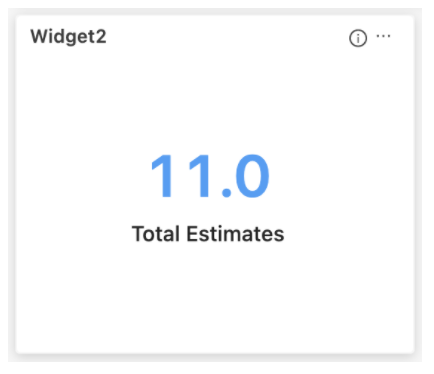
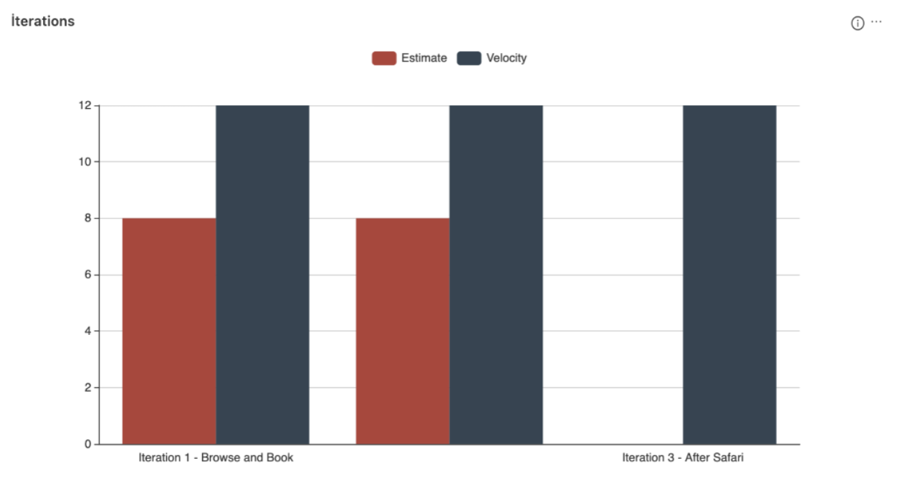
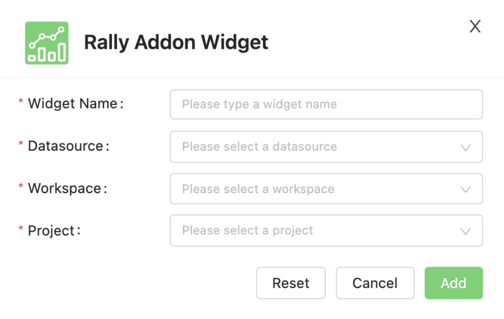

# QA Dashboard Custom Addon Document

You can develop custom addon integration to show your own widgets on the [QA Dashboard](https://dashboard.qa/).

#### The implementation of the following endpoints is required:

- GET /api/ping
- GET /scopes
- GET /scopes/{scope}/fields
- GET /scopes/{scope}/fields/{field_key} (required if dynamic loading of field options is used)
- GET /scopes/{scope}/widget/data

Expected responses and other details of the endpoints are mentioned in the document below.

## Integration Steps

#### 1. Click the custom addon button on the top right of the QA Dashboard Marketplace page.

<p align="center"></p>

#### 2. The fields in the popup should be filled according to the following information.

<p align="center"></p>

- **Name:** You must name the addon you add to see it on other pages.
- **Short Description:** You must fill in to see the description of the addon you will add on other pages.
- **Category:** You must categorize the addon you will add in order to access it easily on other pages.
- **Icon Upload:** You can add an icon to your Addon.

#### 3. After adding the custom addon, you can add the data source definition from the "Data Sources" page according to the following explanation.

*A custom addon must have a default data source. Endpoints returning the scope list and widgets' fields will be 
retrieved from this default data source. These endpoints (scopes and widget fields) does not depend on data source.*

After adding the data source information, you can ping your application via test connection button. 
This way you can check that your application is accessible or not. If your project has authentication, 
you need to fill in the API Token field. QA Dashboard will access your APIs with this api token. 
The token will be send in 'Authorization' header as BASE64-encoded.

<p align="center"></p>

To use the 'test connection' feature, you must implement an endpoint according to the information below. 
The QA Dashboard  will access your application through this endpoint and wait for you to return **'UP'** as below.

* GET '{YOUR_SERVER_URL}/api/ping'
```json
{
  "status": "UP"
}
```

#### 4. After adding the data source, there is the id information of the addon that you created on the page. You will need to send the Addon ID while returning the scope information in your own application. Details about 'scope' can be found in the relevant section of the document.

<p align="center"></p>

In this project you must add this addon id to your "V2__data.sql" and "V3__data.sql" files dashboard_addon_id's values sections.
For example: 
```sql
INSERT INTO SCOPE (id, key, dashboard_addon_id, clean_name, icon_url, description, date_filterable, display_type)
VALUES (1, 'iteration_velocity', '60092cbc2e5f596ca362e0cc', 'Iteration Velocity', '/assets/images/icons/sprint.png', 'desc', 0, 'CUSTOM_ECHARTS');
```

Also you must change username and password in "RallyClient" class "createHeaders" method for Rally Dev application:
```java
final String username = "exampleuser@testinium.com";
final String password = "examplePassword";
```

#### 5. When adding a new widget for your addon, a scope selection page is shown as in the image below. You should prepare an endpoint that returns this scope list according to the information given below. 

*Every widget that you create must be linked to a scope. When adding a widget, the information of the fields to be displayed and the data belonging to the widget are matched with this scope.*

<p align="center"></p>

* GET '{YOUR_SERVER_URL}/scopes'
```json
[
  {
    "id": "1",
    "key": "iteration_velocity",
    "addonId": "60092cbc2e5f596ca362e0cc",
    "cleanName": "Iteration Velocity",
    "iconUrl": "/assets/images/icons/sprint.png",
    "desc": "desc",
    "dateFilterable": false,
    "displayType": "CUSTOM_ECHARTS"
  },
  {
    "id": "2",
    "key": "metrics_with_query",
    "addonId": "60092cbc2e5f596ca362e0cc",
    "cleanName": "Metrics with Query",
    "iconUrl": "/assets/images/icons/azure_devops_boards.png",
    "desc": "desc",
    "dateFilterable": false,
    "displayType": "CUSTOM_TEXT_PANEL"
  }
]
```

The example above shows an addon made up of two scopes. The fact that it has two scopes means it supports two different widget types.

- **id:** This is your scope id. We will use this information while we requesting your apis. 
  You will use this information to distinguish which widget's data we want.
- **key:** This is your scope key. You can use this information to distinguish which widget's data we want.
- **addonId:** This is your addon id. As we mentioned in datasource section, you must send the addon information 
  given on the screen in this field.
- **cleanName:** This is your scope name. Your scope name will be displayed while adding new widget.
- **iconUrl:** This is your scope icon. Your scope icon will be displayed while adding new widget.
- **desc:** This is your scope description. Your scope description will be displayed while adding new widget.
- **dateFilterable:** This field indicates whether your widget supports date filtering. It can be true or false. 
  When the date filter is changes on the dashboard, date information is also sent to the widget's data endpoint.
  These parameters are sent as named 'from' and 'to' in milliseconds. 
- **displayType:** DisplayType field specifies the type of widget to be displayed on the dashboard. 
  There are currently two displayType options. (CUSTOM_TEXT_PANEL and CUSTOM_ECHARTS)

**'CUSTOM_TEXT_PANEL'** displayType can be used to display data in the form of label and value on the dashboard.

<p align="center"></p>

**'CUSTOM_ECHARTS'** displayType can be used to show the graphic types supported by the Apache ECharts library on the dashboard.

You can use any type of chart from the Apache ECharts with this implementation. [See the Apache ECharts examples.](https://echarts.apache.org/examples/)

<p align="center"></p>

#### 6. Once the Scope is selected, the fields associated with the scope are displayed in the add widget popup. Widget Name and Datasource fields on this screen are default fields, all other fields can be customized. You can show any number and type of field you want.

<p align="center"></p>

*These fields will be retrieved in by requesting the endpoint you will prepare.*
*The example above shows an example with 2 custom fields. (there are 4 fields with default fields)*

* GET '{YOUR_SERVER_URL}/scopes/{scope}/fields'
```json
[
  {
    "name": "Workspace",
    "key": "workspace",
    "type": "dropdown",
    "validators": [
      "required"
    ],
    "placeholder": "Please select a workspace",
    "multiSelect": false,
    "affects": [
      "project"
    ],
    "data": {
      "content": null
    }
  },
  {
    "name": "Project",
    "key": "project",
    "type": "dropdown",
    "validators": [
      "required"
    ],
    "placeholder": "Please select a project",
    "multiSelect": false,
    "affects": [],
    "data": {
      "content": null
    }
  }
]
```

- **name:** This is the field name that will be shown on the add widget pop-up.
- **key:** This is your field key. You can use this information to distinguish which field's data we want.
- **type:** This is the field that specifies the type of field. It can be 'dropdown' or 'input'.
- **validators:** You can add validators to determine whether the field is required and the regex format of the text to be typed.
- **placeholder:** This is the field placeholder that will be shown on the add widget pop-up.
- **multiSelect:** This option specifies whether the field supports multiple selections. It can be true or false
- **affects:** Affects field is used to fill the fields dynamically according to any other field. 
  For instance, when the 'workspace' is selected, you want the projects to be filled in the 'project' field automatically. 
  the key of the project area should be given as 'affects' of the workspace in this case.
- **data:** Options in the dropdown field. If your options are static, you can send these options in data.
  Otherwise, you should use affect key and prepare for an api to load options dynamically.
  
*For dropdown fields, there are two ways to load the options to show. 
If there are a fixed number of hardcoded options (like yes / no), these options can be sent directly in the data field.
If the field options are to be loaded dynamically according to another field selection (as mentioned in the affects), these data will be retrieved via api call.*

*for static options, data attribute should be sent like below.*

```json
{
  "data": {
    "content": [
      {
        "key": "count",
        "label": "Count"
      },
      {
        "key": "effort",
        "label": "Effort"
      }
    ]
  }
}
```

*for dynamic options with affects, data will be retrieved via an api call like below.*
  
* GET '{YOUR_SERVER_URL}/scopes/{scope}/fields/{field_key}'
```json
[
  {
    "key": "39a322a5-5ae2-45a2-9d7c-bf8196c6dfc3",
    "value": "Sample Project I"
  },
  {
    "key": "9962bef2-6688-4d1b-9c8b-8e98e6628d34",
    "value": "Sample Project II"
  }
]
```

#### 7. After the widget is saved, the data to be displayed on the dashboard is retrieved with the following endpoint. All information entered in "Add Widget" pop-up will be sent as request parameters.

* GET '/scopes/{scope}/widget/data' 
  
Example Response for CUSTOM_ECHARTS displayType 
```json
{
  "yAxis": [
    {
      "type": "value"
    }
  ],
  "xAxis": [
    {
      "data": [
        "Iteration 1 - Browse and Book",
        "Iteration 2 - Streamline Operations",
        "Iteration 3 - After Safari"
      ],
      "axisTick": {
        "show": false
      },
      "type": "category"
    }
  ],
  "legend": {
    "data": [
      "Estimate",
      "Velocity"
    ]
  },
  "series": [
    {
      "data": [
        8,
        8,
        0
      ],
      "barGap": 0,
      "name": "Estimate",
      "emphasis": {
        "focus": "series"
      },
      "type": "bar"
    },
    {
      "data": [
        12,
        12,
        12
      ],
      "name": "Velocity",
      "emphasis": {
        "focus": "series"
      },
      "type": "bar"
    }
  ],
  "tooltip": {
    "axisPointer": {
      "type": "shadow"
    },
    "trigger": "axis"
  }
}
```

* GET '/scopes/{scope}/widget/data'

Example Response for CUSTOM_TEXT_PANEL displayType
```json
{
  "title": "Total Estimates",
  "value": "11.0"
}
```

Note: If you select "Metric with Quey" scope, you can type "(Project.Name contains "Sample Project")" in the "Metric Query" field.

## Requesting Support

Contact us for requesting support --> [QA Dashboard](https://dashboard.qa/contact/)
